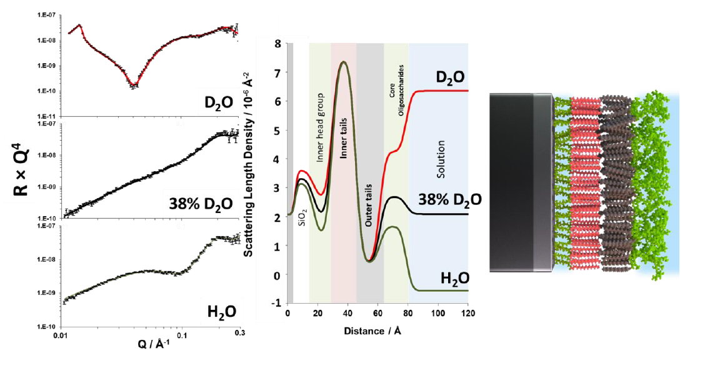
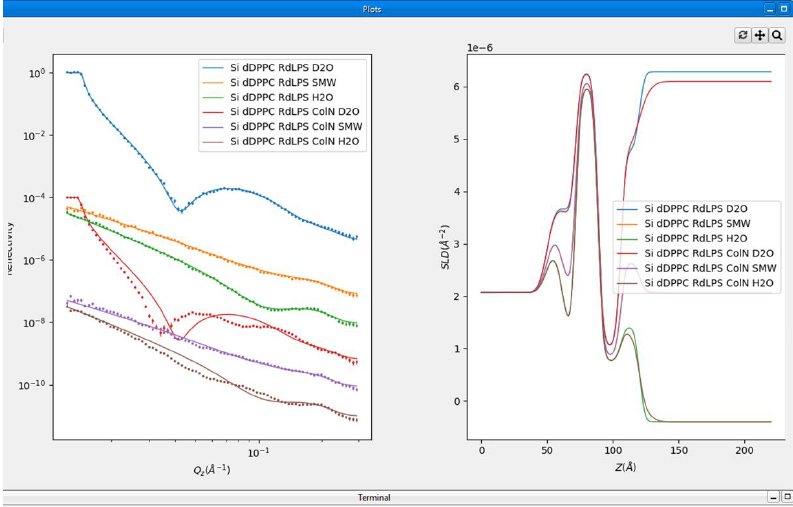
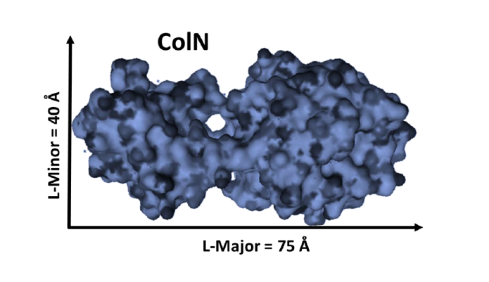
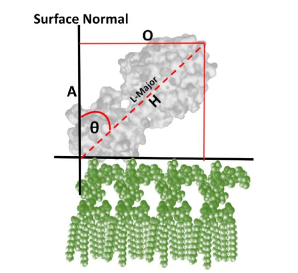

Fitting a Complex Protein-Bound Membrane Structure
==================================================
The final part of this practical is a challenge of you new-found fitting and scripting skills and will test some
basic trigonometry.

In the folder **RasCal 2 Practical Student/Part 5 Complex model** you will find a complete project with data which has
previously been published in |langmuir_32_14|. In this example we have a complex membrane structure at the
silicon-water interface which is representative of the Gram negative bacterial outer membrane.

This structure contains an asymmetric distribution of lipids with an inner leaflet composed tails deuterated
phospholipid (in this case d62-dipalmitoylphosphatidylcholine) and an outer leaflet of bacterial lipopolysaccharides
which are hydrogenous (or 99.98% protium labelled). The figure below gives some details of this structure:

  Neutron reflectivity profiles and model data fits (A–C) and the scattering length density profiles these fits
  describe (D) asymmetric DPPC (inner leaflet)/Rd LPS (outer leaflet) bilayers in the presence of 20 mM HEPES pH 7.2
  buffer with 20 μM CaCl2. The three simultaneously fitted isotopic contrasts shown are (A) d-DPPC/Rd LPS in D2O
  (red line), (B) d-DPPC/Rd LPS in SMW (black line), and (C) d-DPPC/Rd LPS in H2O (green line). A representation of
  the interfacial structure determined from these fits is shown (E).

Above we have reflectometry data (shown in R × Q4 format, great for publications to show quality of fits) from the
asymmetric membrane structure examined under three differing solution contrasts (D2O, Si-MW (38% D2O) and H2O). From
the analysis of the data we reveal the internal structure of the bilayer at the solid/liquid interface. The deuterated
phospholipid component is located in the inner membrane leaflet close to the silicon interface and the hydrogenous
lipopolysaccharide is located in the outer leaflet close to the bulk solution. Note that the profile for this consists
of lipid tail and sugar head-group (core oligosaccharide) region.

Upon opening the Part 5 Complex model folder the following data sets and fits will load in RasCal:

You will see six NR data sets which describe an asymmetric membrane structure across the silicon-water interface.
The top three data sets come from the membrane only and you can see are well fitted to the SLD profile shown on the
left. The bottom three data sets are the same membrane after the binding of the antibacterial protein colicin-N (ColN)
to the surface and, as can be seen, are not well fitted to a model which does not have the protein on the surface
(line is model fit and error bars are data).

ColN is a cigar shaped protein:

This prolate shape means that a; with a single layer of protein on the surface of the membrane the thickness of that
layer will be between 40 and 75 :math:`\mathring{A}` and b; that from that thickness we can determine the angle of the
protein relative to the membrane surface:

Using RasCal we will fit the angle of ColN relative to the surface normal and convert this value in the RasCal custom
file into a thickness which will be input into the Abeles matrix calculation in the software.

The area of code you need to pay the most attention to is the area where we convert protein surface angle to thickness
(lines 26 to 51):

.. code-block:: Python

    ##ColN angle to thickness conversion code! Remember your trigonometry

    ## Protein axes
    ColN_minor_axis = 40
    ##COlN is a cigar shaped protein and this length is the minor (thinnest axis)
    ColN_major_axis = 75 ##This is the longest axis.

    ## Convert angle to radians
    ##Here we convert the angle to radians.
    ColN_Layer_angle_rad = ColN_Layer_angle * np.pi / 180.0

    ## Ratio from angle
    ##Here we you need to
    ##specify how we determine the ratio between our two length scales.

    ColN_ratio = 0

    ## Thickness interpolation
    ## Here we then need to relate the ratio to the thickness
    ## of the proteins minor and major axis

    ColN_Layer_Thickness = 0

Note the parameters that describe what you want to fit for the protein are already in the parameter list but they have
not been added to the structure yet which you need to do once the relationship between angle and protein layer
thickness has been defined.

Once you have done this, save the custom model and **Accept Changes**. If the model compiles, fit the data to resolve
the angle of ColN relative to the membrane surface.

.. hint::
    Just select the protein layer parameters to fit

.. |langmuir_32_14| raw:: html

   <a href="https://doi.org/10.1021/acs.langmuir.6b00240" target="_blank">Langmuir 32 (14), 3485-3494</a>