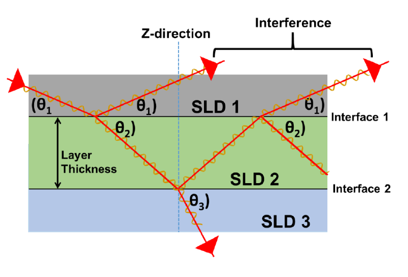

Advanced Neutron Reflectometry Data Analysis for Soft Matter Systems
====================================================================

Introduction
------------
In this tutorial, you will fit layer models to experimental reflectivity datasets
and use these fits to gain quantitative information about the molecular structure of material
across a buried interface. To do this you will use the :ref:`RasCal 2 software <install>` which calculates slab
layer models using Abeles matrix formalism, which is conceptually very similar to Parratt’s
recursive formalism which is also used in reflectometry data analysis.

In these approaches, each layer is described by its thickness, roughness and scattering length
density (SLD, ρ). The thickness of each layer is used to determine the phase of the reflected
waves from each "slab" layer interface (top and bottom). Kiessig fringes in the reflectivity data
are due to interference between these reflected waves.

More information on the mathematics of Parratt’s recursive formalism is available in |PhysRev_95_359|.

  The "slab" layer model is used to calculate model reflectivity data by both the Abele’s matrix formalism
  and Parratt’s recursive formalism. The difference in scattering length density (ρ) at an interface and
  the angle/wavelength of the neutron beam give the magnitude of reflection while thickness of the layer
  and its effect on the phase difference between the top and bottom reflections gives rise to Kiessig Fringes.

In the following sections, you will start by examining the structure of a silicon-D2O interface
using the RasCAL's model building GUI followed by fitting the same data using a custom model fitting.
Then, the structure of a bilayer of 1,2-dipalmitoylphosphatidylcholine (DMPC) will be examined using
multiple solution isotopic contrasts firstly with a simple "volume" fraction model followed by analysis
using a more advanced "area per molecule" model. The |tutorial data| required for this will be the reflectivity data
from the |ISIS neutron training course| solid-liquid flow cells practical on the |OFFSPEC reflectometer|.
Finally, we will take a look at a complex layer structure with a composite fringe pattern from a multi-layered
membrane complex.

.. important:: Download the |tutorial data| to follow along in the next sections.

Sections
--------

.. toctree::
   :hidden:

   Introduction <self>

.. toctree::
   :titlesonly:
   :numbered:

   silicon_water_interface
   custom_model_fitting
   model_fitting_by_volume_fraction
   model_fitting_by_area_per_molecule
   fitting_complex_membrane_structure

.. |ISIS neutron training course| raw:: html

   <a href="https://indico.stfc.ac.uk/event/792/" target="_blank">ISIS neutron training course</a>

.. |OFFSPEC reflectometer| raw:: html

   <a href="https://www.isis.stfc.ac.uk/instruments/offspec/" target="_blank">OFFSPEC reflectometer</a>

.. |PhysRev_95_359| raw:: html

   <a href="https://doi.org/10.1103/PhysRev.95.359" target="_blank">PhysRev 95, 359</a>