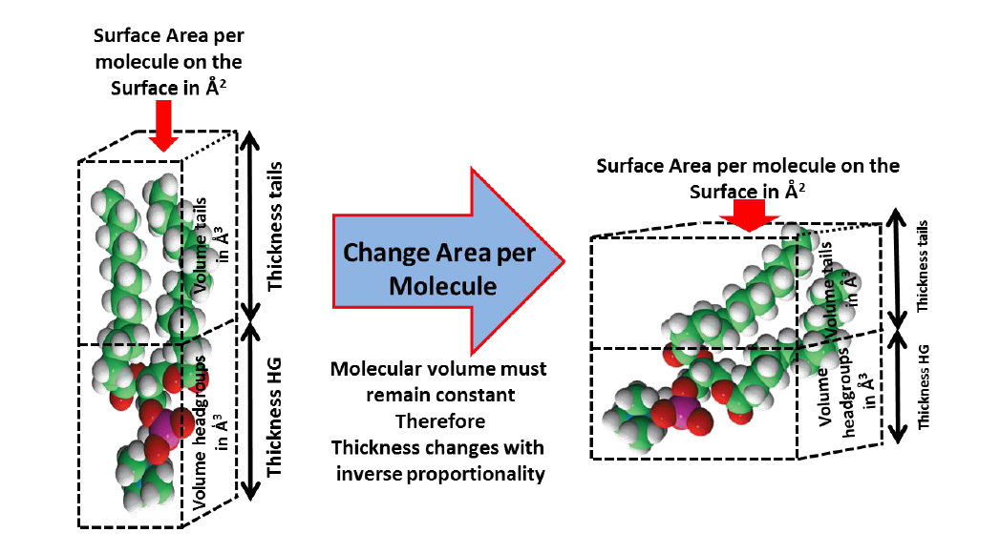

Fitting a Custom Model of the Bilayer by Area per Molecule
==========================================================
In the previous section different layers arising from the same molecular species are fitted in an unconstrained manner.
This can cause some ambiguity in the analysis as there can be differing total molar amounts of head and tail components
in the resolved structural data.

A better approach is to couple these parameters together using a known shared parameter. In most cases this will be
area of the surface occupied by the molecule (i.e. Area Per Molecule). As each lipid head and tail, being a part of the
same molecule, will occupy the same 2-dimensional area of the sample surface. This area will be related to the
thickness of the sample by:

.. math:: \text{Occupied Surface Area} = \frac{\text{Component Volume}}{\text{Layer Thickness}}

The volume of the tail and head groups are linked to the sum of the atomic volumes which make up the molecule and
therefore will not change (within a given phase). The thickness is inversely correlated to the area per molecule and
therefore only a single parameter for both the head and tail groups needs to be fitted, that is the area per molecule
at the surface. Below is a diagrammatic representation of this concept:

In the example we will use the molecular volumes of the head and tail components of DMPC to construct a model which
fits the bilayer at the silicon water interface by four parameters only. That is, the area per molecule, the total
bilayer hydration (i.e. presence of defects across the surface) and the headgroup hydration (i.e. water bound to the
hydrophilic headgroups) and bilayer roughness.

For this section of the practical you will edit a custom area per molecule model, completing parts of the code which
are missing.

**Starting the project**

In RasCAL-2, click on **Import Existing Project** and browse to the tutorial data folder named
**Rascal 2 Practical Student** and select the folder named **Part 4 Scripted APM bilayer** and select open,
then click the Load button

You will see five sets of data, Contrasts 1, 2 describe the SiO2 layer at the interface only, while 3, 4 and 5 describe
the same surface coated with a DMPC supported lipid bilayer in D2O, SMW and H2O solution respectively. Currently
however, the model does not describe the DMPC bilayer structure. You will need to add this!

The relationship between layer thickness, component volume and area per molecule is:

.. math:: Thickness = \frac{Volume}{\text{Area Per Molecule}}

And component volume, scattering length and scattering length density is:

.. math:: SLD (\rho) = \frac{\sum b}{Volume}

The volume and the scattering lengths (:math:`\sum b`) of each of the interfacial components are known. By fitting the experimental
reflectivity data we can determine the interfacial lipid area per molecule and layer thicknesses.

The SLD of the lipid headgroups and tails can be calculated using priori information, using this, the solution is
present in each of the headgroup and tail regions of the bilayer can be determined.

There is a differential in solution content within the headgroups and tails. As the tails will only have water content
through defects while the headgroups have hydration waters as well as water present due to defects. The model built
during this part of the exercise will discriminate between these hydration types.

Edit the model and then edit the custom model i.e. Click **Edit Project**, navigate to the **Custom Files** tab and click Edit File.
You will find the following incomplete code to describe the interfacial layer structure:

.. code-block:: Python

    import numpy as np

    def custom_bilayer_DMPC(params, bulk_in, bulk_out, contrast):

        ## Parameters to Fit
        sub_rough = params[0]
        oxide_thick = params[1]
        oxide_hydration = params[2]
        HG_bound_waters = params[3]
        #DMPC_APM = params[4]
        #Bilayer_roughness = params[5]
        #Bilayer_hydration = params[6]

        ## We have a constant SLD for the bilayer
        oxide_SLD = 3.41e-6

        ## Known Volume in Angstrom cubed
        DMPC_HG_Volume = 320.9
        DMPC_Tails_Volume = 783.3
        Water_Volume = 30.4

        ##Known Scattering Lengths
        DMPC_HG_SL = 6.41e-4
        DMPC_Tails_SL = -3.08e-4
        H2O_SL = -1.4e-5
        D2O_SL = 2e-4

        ## Relate HG Bound Waters to SL and Volume
        HG_Waters_D2O_SL = HG_bound_waters * D2O_SL
        HG_Waters_H2O_SL = HG_bound_waters * H2O_SL

        Headgroup_water_volume = HG_bound_waters * Water_Volume

        ## Add to HG volumes, SLs and Calculate nSLD

        #Volume_HG = ? + ? ##The headgroup volume plus the water volume

        #DMPC_HG_SL_D2O = ? + ? ##Clue it’s the same as before but with the water added
        #DMPC_HG_SL_H2O = ? + ?

        #SLD_HG_D2O = DMPC_HG_SL_D2O/Volume_HG
        #SLD_HG_H2O = DMPC_HG_SL_H2O/Volume_HG
        #SLD_HG_SMW = (0.38 * SLD_HG_D2O) + (0.62 * SLD_HG_H2O)

        #Tails_SLD = DMPC_Tails_SL/DMPC_Tails_Volume

        ## Thicknesses
        ## Calculate the thickness from the HG volume over the lipid Area per
        ## molecule

        #Headgroup_thickness = Volume_HG/DMPC_APM
        #Tails_thickness = DMPC_Tails_Volume/DMPC_APM

        ## Now construct your layers adding in a single roughness parameter and a
        ## parameter for defects (hydration)

        oxide = [oxide_thick, oxide_SLD, sub_rough, oxide_hydration, 2]
        #Head_D2O = [?, ?, ?, ?, 2]
        #Head_H2O = [?, ?, ?, ?, 2]
        #Head_SMW = [?, ?, ?, ?, 2]
        #Tail = [?, ?, ?, ?, 2]

        ## Add your layer defined above to the layer stack
        match contrast:
            case 1 | 2:
                output = np.array([oxide])
            case 3:
                output = np.array([oxide])
            case 4:
                output = np.array([oxide])
            case 5:
                output = np.array([oxide])

        return output, sub_rough

In this code you will notice there are single commented lines (#) and double commented (##) lines. The double commented
lines are notes and hints while the single commented lines are the lines of code you must complete by the replacing the
questions marks (?) with the correct information.

The parameters you wish to fit are commented out in the parameters section of the code. These are:

.. code-block:: Python

    HG_bound_waters = params[3]
    DMPC_APM = params[4]
    Bilayer_roughness = params[5]
    Bilayer_hydration = params[6]

These also need to be added to the parameter list in RasCal. Suitable parameter ranges for these are:

    | **HG_bound_waters**: lower = 0 waters, upper = 10 waters.
    | **DMPC_AreaPerMolecule**: lower = 0 :math:`\mathring{A}`2, Upper = 100 :math:`\mathring{A}`2.
    | **Bilayer_roughness**: lower = 2 :math:`\mathring{A}`, upper = 10 :math:`\mathring{A}`.
    | **Bilayer_hydration**: lower = 0%, upper = 100%.

.. hint:: Add these parameters to the list in RasCal

The code below the fitted parameters details the relationship between these parameters and the parameters which define
the layers i.e. the layer parameters SLD, thickness, roughness and hydration.

Once you have uncommented and placed the correct info in all the lines of code you must add the bilayer structure to
cases 3, 4 and 5.

.. hint:: Input the following layer structure in contrast (Case) 2 and 3 once you have determined the relationship
    between area per molecule, thickness and SLD and defined your layers:

.. code-block:: Python

    Case 3:
        output = ([Oxide, HEADFGROUP_D2O, TAIL, TAIL, HEADGROUP_D2O])
    Case 4:
        output = ([Oxide, HEADFGROUP_SMW, TAIL, TAIL, HEADGROUP_SMW])

.. note:: Here we define the tails as two layers rather than a single layer (as was done previously).
