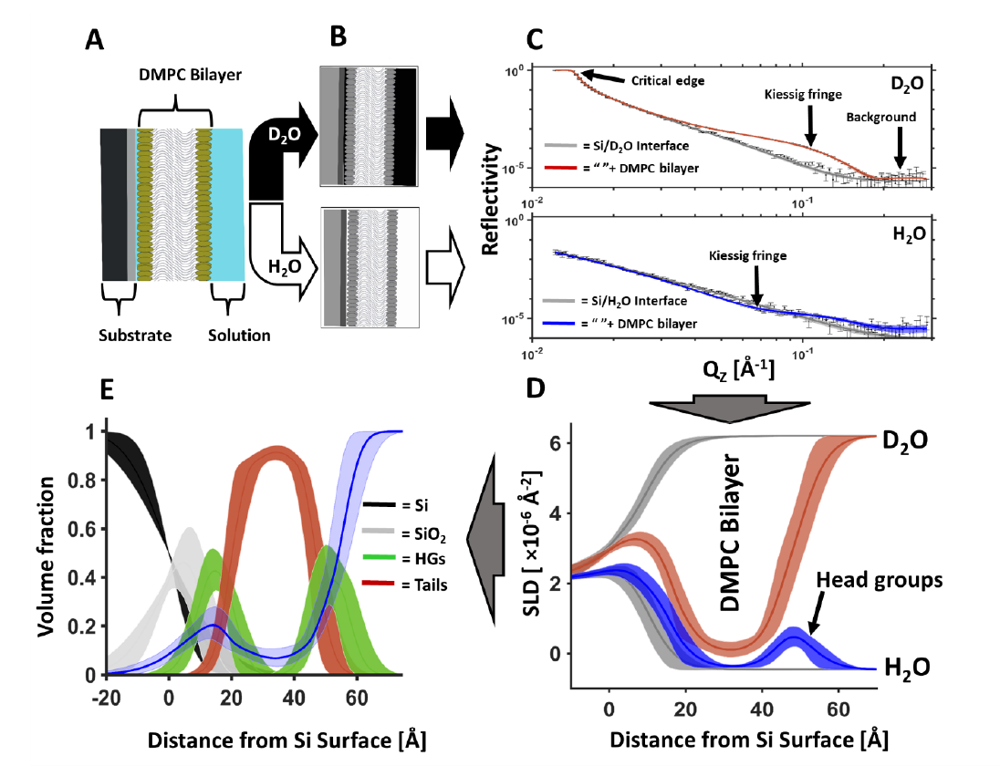

Fitting a Custom Model of the Bilayer by Volume Fraction
========================================================
We will now create a custom model of the interfacial structure coated with a
1,2-dimyristoyl-sn-glycero-3-phosphocholine (DMPC) bilayer and fit the experimental reflectometry data. Starting with
the project you have created in part two, using the skills you’ve learned you will create a custom model to resolve
the structure of the supported lipid bilayer.

Below is an example of the encoding and decoding of the structure of a DMPC bilayer at the solid-liquid interface by
neutron reflectometry. Two solution isotopic contrasts (|D2O|; red, and |H2O|; blue, C) are used to resolve the
scattering length density (SLD) profiles (D) across the surface. The resolved structural parameters are ultimately
used to resolve the component volume fraction vs. distance profile across the surface:

The simultaneous fitting of these same two solution isotopic contrast data sets (|H2O| and |D2O|) was used to resolve the
interfacial lipid bilayer structure here, which will be constrained against the data for the Si Interface only. You
will be doing the same thing in RasCal 2 but with more data!
To test your fitting skills

1. Let’s start by setting up the DMPC contrasts and fitting parameters.
2. Edit the project and in the Data tab add for the DMPC supported lipid bilayer. This is found in the
   **RasCal 2 Practical Student/DMPC data named** folder as **Si_DMPC_D2O.dat**, **Si_DMPC_SMW.dat**,
   and **Si_DMPC_H2O.dat**.

3. You will note that there are three data sets here under three solution isotopic contrast conditions. |D2O| and |H2O|
   are the same as for our previously fitted Si surface contrasts but we have an additional contrast called SMW. This
   is silicon matched water (38% |D2O| and 62% |H2O|). This additional contrast provides additional constraint for our
   model fitting.
4. Add a background for the SMW contrast (like you did previously for the |H2O| contrast).
5. Add a new bulk out for the SMW contrast with a value of :math:`2.07\text{e-6}\mathring{A}^{-2}`. Set a min and a max
   around this.
6. Next we want to start building a model of the DMPC interfacial structure.
7. In do this we identify our "knowns" and "unknowns". We know the scattering length densities of the DMPC headgroups
   and tails:

   .. math:: Tails = -0.39 \times 10^{-6}\mathring{A}^{-2}
   .. math:: \text{Head groups} = 1.98 \times 10^{-6}\mathring{A}^{-2}

   But this only takes into account a situation where the layer is composed of a single component only. The DMPC
   bilayer, like the |SiO2| layer is immersed in solution and therefore hydrating water is present in the head groups
   and potentially in the tails if the bilayer has defects, therefore we should fit two hydration parameters (heads and
   tails) to experimentally resolve these unknowns.
   Additionally we should fit the tails thickness, headgroup thickness, and a single bilayer roughness parameter (to
   account for undulations across the bilayer). Add these to the **Parameters** tab using the bounds shown below.

   .. figure:: ../images/tutorial/dmpc_bilayer_project_parameters.png
     :alt: DMPC bilayer project parameters

8. Now we need to edit the custom model to add the DMPC bilayer structure. Go to the General tab and click Edit. Now
   edit the custom model script to add the new unknown parameters and the known parameters. Define layers for the
   headgroups and tails of the bilayer and create two new contrast cases both with silicon oxide layers but
   additionally with a bilayer layers across the interface as well (Headgroup; Tails; Headgroup).

.. hint:: How to construct your bilayer parameters.

   To complete this assignment you need to describe a structure across the interface for three data sets from a DMPC
   coated silicon surface which is composed of the following layers:

   ([oxide, Head, Tail, Head])

Below is an example of this done with one Headgroup and |SiO2| layers only as a guide:

.. code-block:: Python

    def custom_model(params, bulk_in, bulk_out, contrast):

        # Fitted parameters i.e. unknowns
        sub_rough = params[0]
        oxide_thick = params[1]
        oxide_roughness = params[2]
        oxide_hydration = params[3]
        Bilayer_roughness = params[4]
        Headgroup_thickness = params[5]
        Headgroup_hydration = params [6]
        Tails_thickness = params [7]
        Tails_hydration = params [8]

        # knowns
        oxide_SLD = 3.41e-6
        DMPC_Heads_SLD = 1.98e-6

        # Make the layers
        oxide = [oxide_thick, oxide_SLD, oxide_roughness, oxide_hydration, 2]
        Heads = [Headgroup_thickness, DMPC_Heads_SLD, Bilayer_roughness, Headgroup_hydration, 2]

        # Match the layer stack to the contrast list in RasCal 2
        match contrast:
            case 1 | 2:
                output = np.array([oxide])
            case 3:
                output = np.array([oxide, Heads])
            case 4:
                output = np.array([oxide, Heads])
            case 5:
                output = np.array([oxide, Heads])
        return output, sub_rough

.. caution:: Parameter names in the RasCal custom model cannot have spaces between words while in the RasCal GUI
  parameter list they can.

Once you have added the new data sets and updated the custom model compile your new script by saving the script and
clicking **Accept changes** in the project window. It will not compile if there are errors. You should now see three
additional NR data sets appear in the Plots window. Run a simplex fit to resolve the structure of the DMPC coated
silicon surface.

.. |D2O| replace:: D\ :sub:`2`\ O
.. |H2O| replace:: H\ :sub:`2`\ O
.. |SiO2| replace:: SiO\ :sub:`2`\
