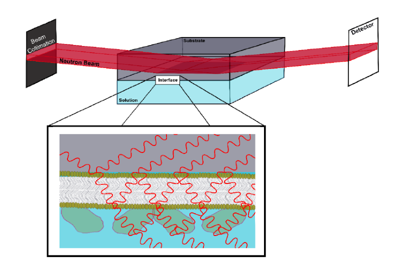
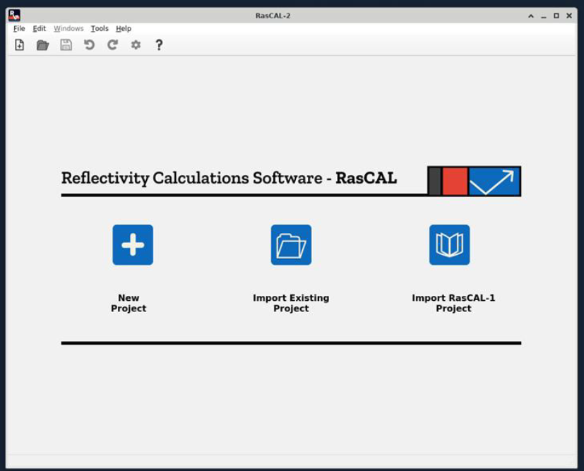
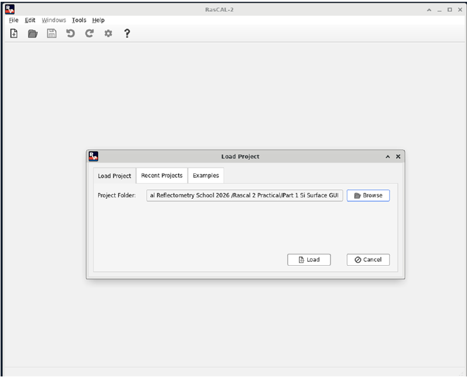
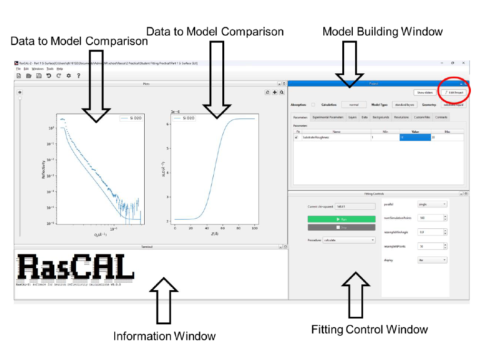

.. _silicon_water_interface:

The Silicon-Water Interface
===========================

The silicon water interface is a common surface used in NR studies. For these experiments, the reflection occurs
within a silicon substrate.

  Neutron Reflectometry in a solid-liquid flow cell. Note: the neutron beam is reflected inside of the substrate.

.. important:: Remember to download and extract the |tutorial data| to follow along in this section.

You will begin the tutorial by fitting a bare SiO2 coated silicon-D2O interface using RasCAL-2.

**Starting the Software**

Start RasCAL-2, the software will load and show the following screen:

Click on **Import Existing Project** and browse to the tutorial data folder named **Rascal 2 Practical Student** and
select the folder named **Part 1 Si_D2O Interface** and select open, then click the Load button (see below)

**Setting up the model to fit**

After the RasCAL-2 project has loaded you will see the following:

.. hint:: Rearrange the different windows in the software as you see fit

The first thing you will notice is that the real and model reflectivity data is not on the same scale, i.e. the scale
factor is incorrect. There are similarities and differences between the model data (line) and the experimental
reflectivity data (error bars). Specifically, the critical edge of the reflection is in the same position in both
and while the general decay of the model data intensity against momentum transfer (:math:`Q_z`) and the background
do not match the experimental data.

Therefore, we begin fitting by setting the correct experimental parameters.

1. On the model building window click on the tab labelled **Experimental Parameters**.
2. Next correctly scale the data using the **scale factor** (do this so the model and data critical edges meet) and
   then set the **Background** for the sample (the flat region in the high :math:`Q_z` regime). If you want you can
   fit these parameters by ticking the fit box against each parameter, selecting simplex in Fittings Controls and
   clicking on the **Run** button.
3. Once these are set fit the substrate roughness (the roughness between the bulk interfaces) to gain an approximate
   fit of the data. You will notice you get a good fit to the experimental reflectivity data producing a reflectivity
   profile with a defined step function.
4. However, the roughness will be artificially high as the model does not accurately portray the interfacial structure.
   The silicon substrate will have a thin (~10 |Angstrom|) silicon dioxide layer on the surface. We will now
   add this layer by editing the model.

**Adding an interfacial layer**

1. Click **Edit Project** on the Project window and you will now be able to edit the model window:

   .. figure:: ../images/tutorial/edit_rascal_project.png
     :alt: Editing the tutorial project

2. Click on the parameters tab and add the following four parameters with the following bounds:

   .. figure:: ../images/tutorial/add_parameters_to_project.png
     :alt: Add parameters to the tutorial project

   Set the value, lower and upper bounds for each parameter as shown below. These parameters will be fitted except
   for **SiO2 SLD** so un-tick the fit box for this.

   | **SiO2 Thickness**: lower = 0 |Angstrom|, value = 10 |Angstrom|, upper = 25 |Angstrom|
   | **SiO2 Roughness**: lower = 0 |Angstrom|, value = 3 |Angstrom|, upper = 7 |Angstrom|
   | **SiO2 SLD**: lower = 3.41e-6 |Angstrom|, value = 3.41e-6 |Angstrom|, upper = 3.5e-6 |Angstrom| and do not fit (untick the fit checkbox)
   | **SiO2 Hydration**: lower = 0%, value = 20%, upper = 30%

   .. hint:: The value must be set between these bounds before you start the fit.

3. Next on the **Layers** tab **Add New Layer** and then populate the layer with each parameter in the correct place
   and naming the layer appropriately:

   .. figure:: ../images/tutorial/add_layer_to_project.png
     :alt: Add layer to the tutorial project

4. In the **Contrasts** tab select the only contrast (labelled **Si D2O**) and at the bottom of the tab add your layer
   to the model section between the **Bulk in** and **Bulk out**:

   .. figure:: ../images/tutorial/update_contrast_in_project.png
     :alt: Update contrast in the tutorial project

   Now click **Accept Changes** and the model should be updated with your new layer. Now rerun the fit.
5. You should now see that you have a new layer between the bulk phases which is rather ambiguous i.e. poorly described
   by the experimental data.

   .. admonition:: Activity

       Think about why this is ambiguous and what might help to better resolve this layer?

6. Save the project to another folder **File > Save To Folder** so it can be used in the next section.
