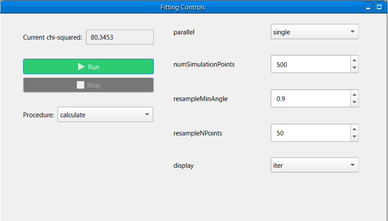
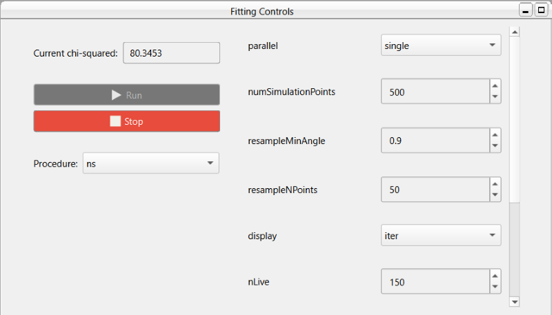

Controls Window
===============
The fitting controls window allows the user select and configure a fit procedure, start/stop a fit, and view
the final chi-squared from a fit.

RasCAL-2 exposes different fit procedures from the Reflectivity Algorithm Toolbox (RAT), a different procedure can
be selected in the procedure dropdown box. When the procedure is changed, the options on the right side of the window
will be updated to match the selected procedure. RAT has |general options| which are available for all procedures and
unique options for each procedure:

1. |simplex|
2. |de|
3. |ns|
4. |dream|

After selecting and configuring a procedure, a fit can be started by clicking the **Run** button, starting a fit will
disable the **Run** button and enable the **Stop** button, to stop a fit simply click the **Stop** button, stopping a
fit will disable the **Stop** button and enable the **Run** button. The **Run** button will be re-enabled if the fit
finishes without being stopped.

.. note:: A calculation cannot be started while editing the project, the control window will be
   disabled until the project is saved.

If the selected procedure is Simplex or DE, stopping a fit before completion will return the current best result, the
current chi-squared textbox will show the best value during the fit. For the remaining procedures, stopping a fit will
not return a result and the current chi-squared textbox is only updated on fit completion.

.. |general options| raw:: html

   <a href="https://rascalsoftware.github.io/RAT-Docs/1.0/tutorial/controls.html#general-parameters-for-the-controls-class/" target="_blank">general options</a>

.. |simplex| raw:: html

   <a href="https://rascalsoftware.github.io/RAT-Docs/1.0/algorithms/simplex.html" target="_blank">Simplex</a>

.. |de| raw:: html

   <a href="https://rascalsoftware.github.io/RAT-Docs/1.0/algorithms/DE.html" target="_blank">Differential Evolution (de)</a>

.. |ns| raw:: html

   <a href="https://rascalsoftware.github.io/RAT-Docs/1.0/algorithms/nestedSampling.html" target="_blank">Nested Sampler (ns)</a>

.. |dream| raw:: html

   <a href="https://rascalsoftware.github.io/RAT-Docs/1.0/algorithms/DREAM.html" target="_blank">DREAM</a>
