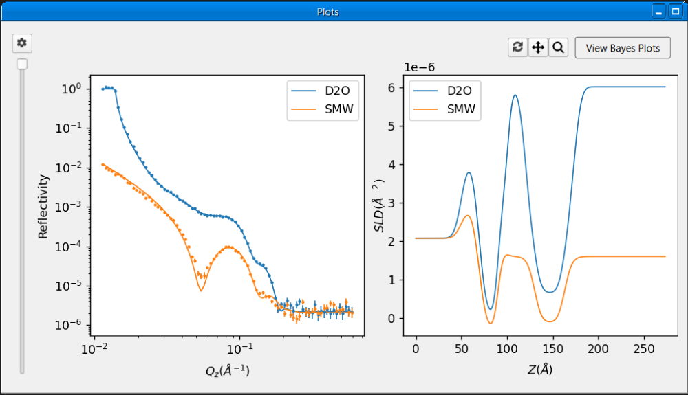
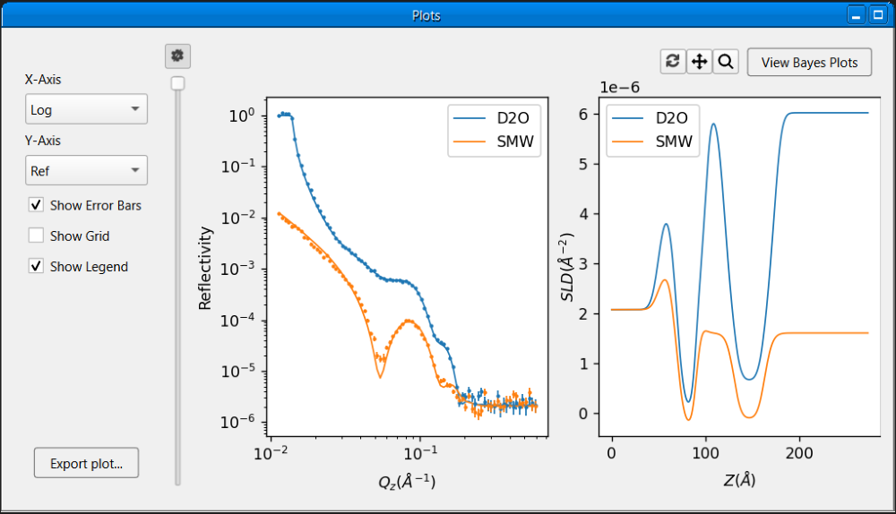
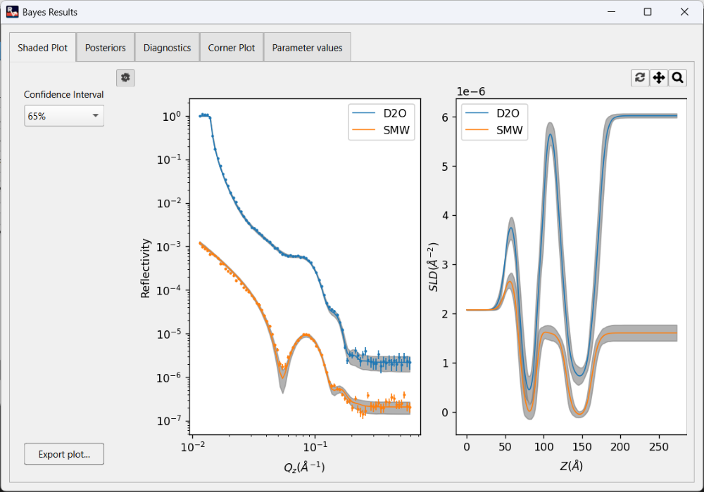
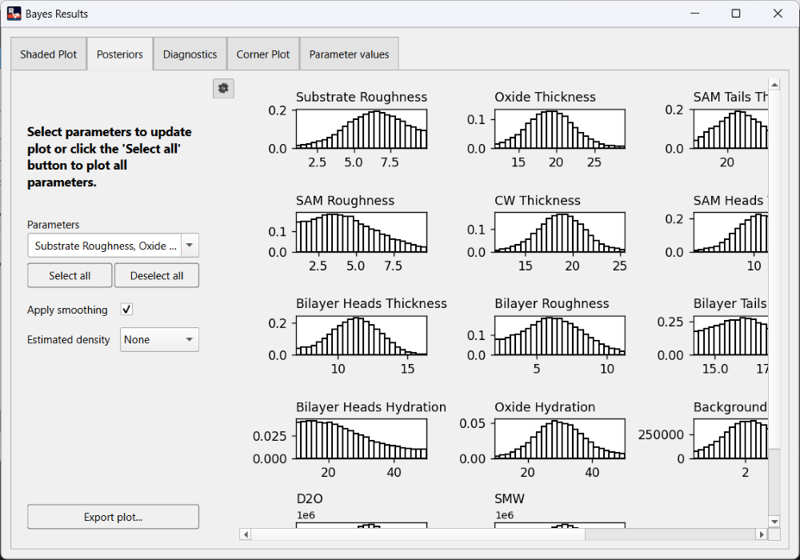
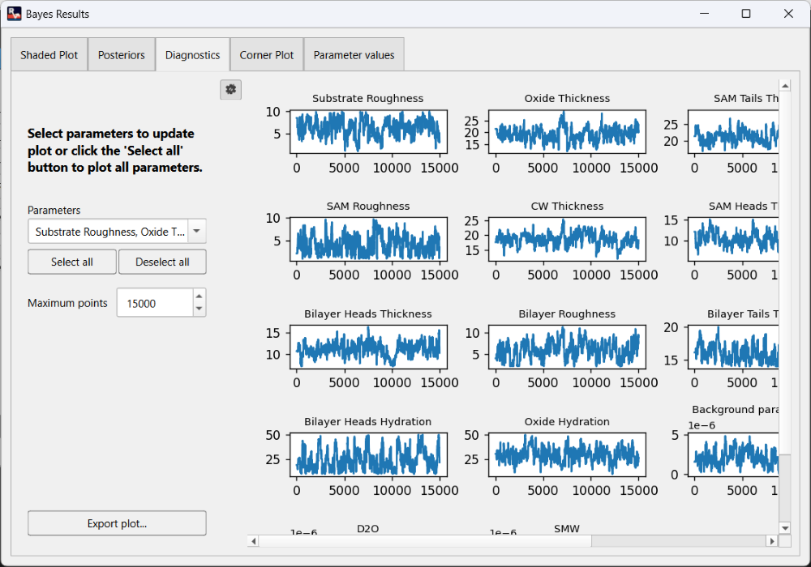
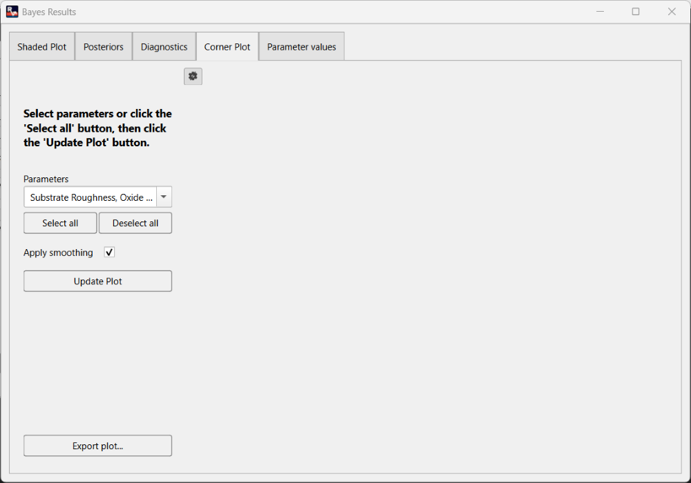
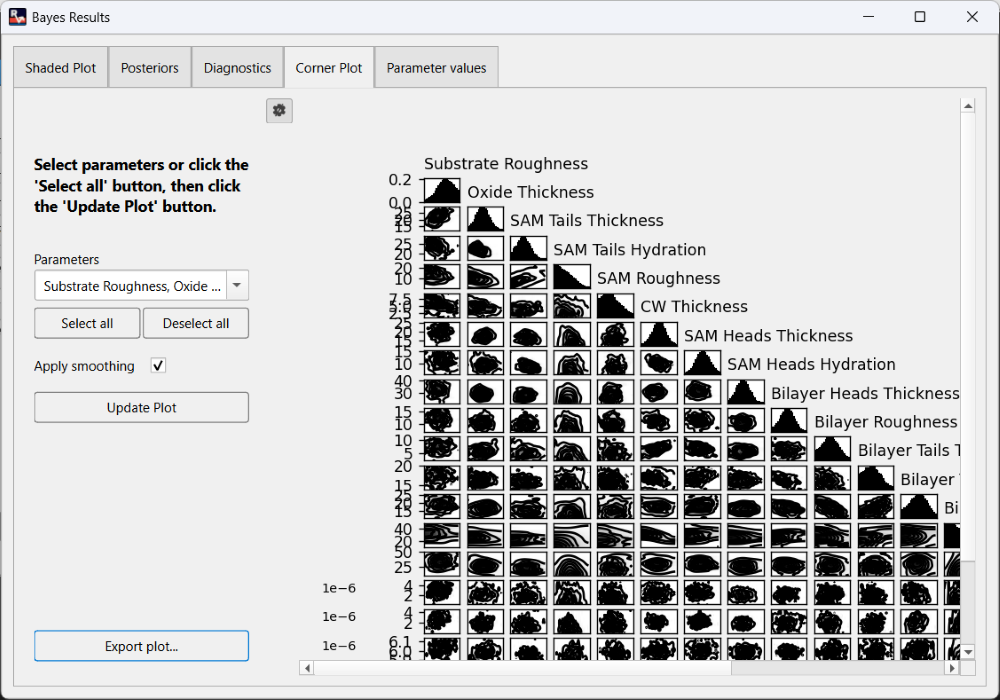
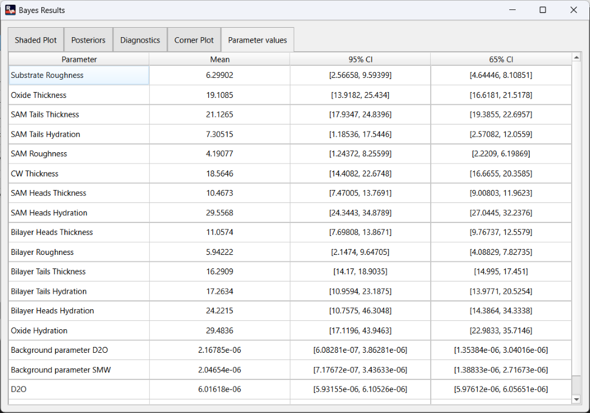

Plot Window
===========
The plot window displays plots of the reflectivity curve and SLD profile. The plots are automatically updated
whenever the results are updated.

Overview
--------
The plot window provides a pan and zoom tool for interacting with the plots. Clicking on the |pan| button will enable
panning and the plots can be panned around by clicking and dragging with the left mouse button. Click the
|pan| button again to disable panning. Clicking on the |zoom| button will enable zooming and the plots can be zoomed
into by clicking and dragging with the left mouse button to select a region. Click the |zoom| button again to disable
zooming. After panning or zooming, the plots can be reset by clicking the |reset| button. Without a reset, the plot
will keep any zoom or pan until it is updated.

The spacing between reflectivity curves in the plot can be adjusted using the slider on the left of the plots, simply
drag and release the slider to change the spacing. The maximum spacing is achieved when the slider is dragged to the
bottom of the window.

The plot window provides more options for customising the plots in a side panel, the |options| button toggles the
visibility of the side panel which can be hidden to amke the plots slightly bigger. The side panel contains the
following options:

1. **X-Axis**: sets the X-Axis of the reflectivity curve to linear or log scale.
2. **Y-Axis**: sets the Y-Axis of the reflectivity curve to show ref or Q^4.
3. **Show Error Bars**: toggle the error bars in the reflectivity curve plot.
4. **Show Grid**: toggles a grid in both plots.
5. **Show Legend**: toggles the legend in both plots.

Bayesian Plots
--------------
After running a Bayesian fit, click the **View Bayes Plots** button in the top right of the plot window to view and
customize plots from the Bayesian analysis. This will open the **Bayes Results** dialog which contains the following
sections:

.. note:: The **View Bayes Plots** button will only be visible after a Bayesian fit is completed, it will be hidden
   for non-Bayesian fits.

1. **Shaded Plot**: This displays a shaded plot with a 65% or 95% confidence interval for the Bayesian analysis. The
confidence interval can be changed using the dropdown in the left side panel.

2. **Posteriors**: This displays the marginalised posteriors for selected parameters from the Bayesian analysis. In the
left side panel, the desired parameters to plot can be selected, plot smoothing can be applied or removed, and estimated
density can be plotted using 3 different methods (normal, log-normal, and KDE).

3. **Diagnostics**: This displays the MCMC chain for selected parameters from the Bayesian analysis. In the left side
panel, the desired parameters to plot can be selected, and the maximum number of points to plot can also be adjusted.

4. **Corner Plot**: This displays the corner plot for selected parameters from the Bayesian analysis. To improve
responsiveness, the corner plot is not drawn immediately, the **Update Plot** button in the left side panel can be
used to draw the plot as needed. Clicking the **Update Plot** button will start rendering the plots in the background,
the button text will show render progress, and the plots will be displayed when rendering is completed. The desired
parameters to plot can also be selected in the side panel, and plot smoothing can be applied or removed.

5. **Parameter Values**: This displays the mean, 65% and 95% confidence interval values for the fitted parameters in
the Bayesian analysis.

Exporting a Plot
----------------
To export any given plot as an image:

1. Click the **Export Plot** button at the bottom of the left side panel.
2. Navigate to the desired save location in the file dialog
3. Enter a name for the file and press the **Save** button.

The plot will be saved as png file with a white background by default, the background can be made transparent
by changing the **Export Background Colour** option to **none** in Settings dialog

