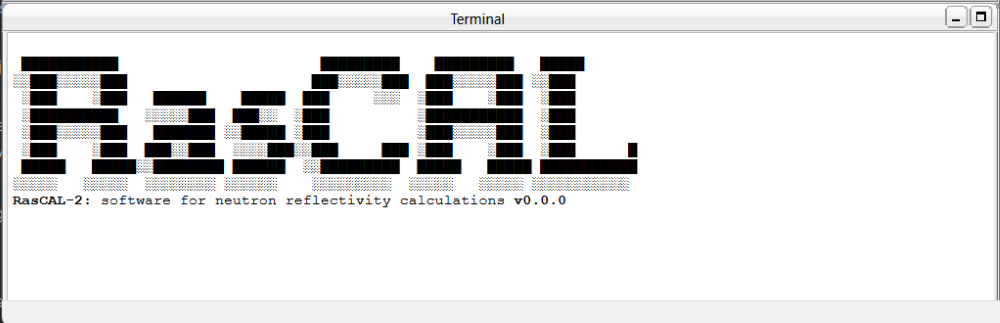
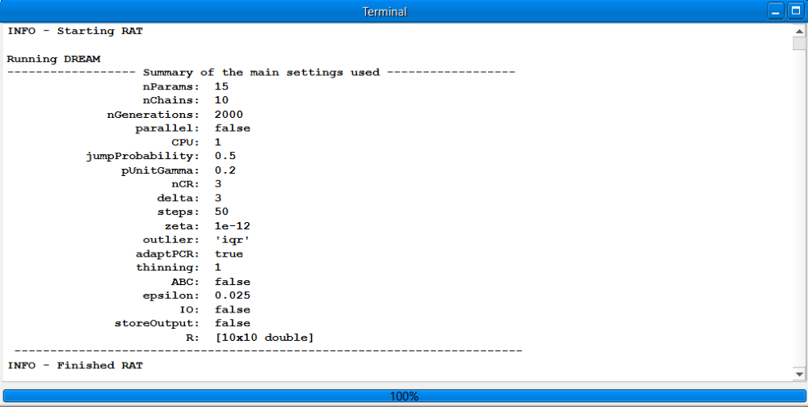
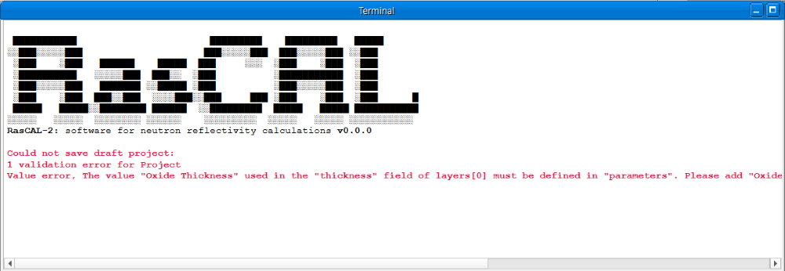

Terminal Window
===============
The terminal window displays fit status, error messages and other information to the user. Messages could
be displayed when modifying a project, running a fit, or when an unexpected issue is encountered. The text
in the terminal cannot be modified but can be selected and copied, the text will be cleared automatically when a
new fit is started but can be cleared manually by clicking *Tools > Clear Terminal* in the menu.

During a fit, the window will inform the user when the run is started, finished, or stopped by user. It will
also show the progress of the fit, the format of the progress information will vary with the procedure e.g. Most
procedures will print a new line of information text as the fit is progressing, but the DREAM procedure will print
a setting summary and show the progress of the fit in a progress bar at the bottom of the window.

.. note::
  The amount of information printed during a fit can be customised using the  `display` or `updateFreq` options
  in the controls window.

If an error occurs during project validation or a fit, an error message would be displayed with red text,
sometimes the message could contain extra debug information which shows the line of code where the error occurred,
this debug information is useful for finding problems with custom files.

